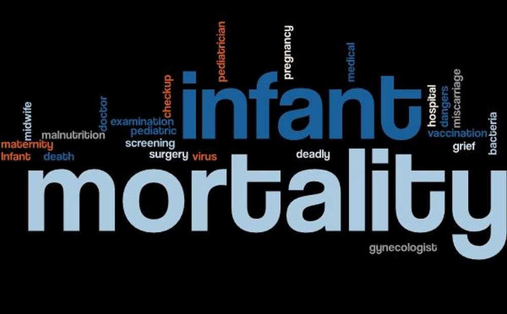

## **Our Project Interest**

We are interested in looking the prevalence of alcohol consumption, tobacco consumption and contraception use in the United States, in comparison to those who do not substance abuse and practice safe sexual behaviors.  The demographics, social dynamics, and healthcare system in the U.S provide a unique perspective on the outcomes of maternal and infant health. We are interested in unpacking this 2007 CDC PRAMS data and understanding different relationships between substance abuse and infant mortality. 

## **What You'll Find on Our Site**

 **Data**: Explanation of the data used in the analysis

 **Explanatory Analysis**: An in depth analysis of the 2007 CDC PRAMS data, specifically regarding infant mortality rate and maternal substance use
 
 **Project Report**: Here you will find a summary of the site, including more background information on this topic
 
 **About Us**: Learn more about the creators of this website!
 
 

Here's a brief overview of our site! (Instert Screencast Here)

